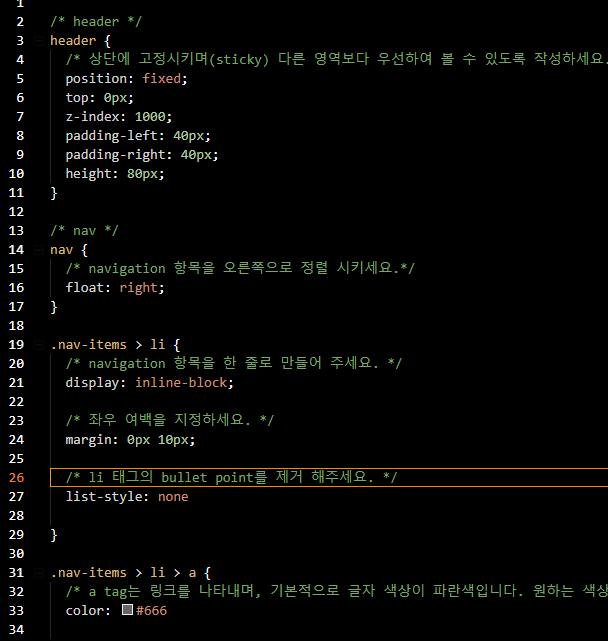

# HTML/CSS를 이용한 영화페이지 작성


## Header 고정 및 맨위로

```css
header {
  /* 상단에 고정시키며(sticky) 다른 영역보다 우선하여 볼 수 있도록 작성하세요. */
  position: fixed;
  top: 0px;
  z-index: 1000;
}
```

position 을 fixed로 하여 고정시켜 스크롤 바를 내려도 상단에 위치하도록 한다.


## nav 항목을 오른쪽정렬(기본은 왼쪽에있음)

```css
nav {
  /* navigation 항목을 오른쪽으로 정렬 시키세요.*/
  float: right;
}
```


## nav 목록(세로정렬)을 가로로 정렬하고 점을 없애준다.

```css
.nav-items > li {
  /* navigation 항목을 한 줄로 만들어 주세요. */
  display: inline-block;

  /* 좌우 여백을 지정하세요. */
  margin: 0px 10px;

  /* li 태그의 bullet point를 제거 해주세요. */
  list-style: none

}
```


## 하이퍼 링크의 색을 바꿔준다

```css
.nav-items > li > a {
  /* a tag는 링크를 나타내며, 기본적으로 글자 색상이 파란색입니다. 원하는 색상으로 바꿔보세요. */
  color: #666

}
```


## hover : 마우스를 올렸을때의 모양

```css
.nav-items > li > a:hover {
  /* hover는 마우스 오버시 모습입니다. 
  이때 하이라이트 되도록 다른 색상으로 바꿔보세요. */
  color: red;

  /* a tag를 마우스 오버하면 밑줄이 나타납니다.
  text를 꾸며주고 있는 밑줄을 없애보세요. */
  text-decoration: none;

}
```


## 배경 이미지 적용 및 텍스트 정렬

```css
#section-title {
  /* 배경 이미지를 적용 해보세요. (이미지는 images/background.jpg) */
  background-image: url('images/background.jpg');
  background-size: cover;
  background-position: center;

  /* 텍스트를 가운데 정렬 해보세요. */
  text-align: center;

  /* 텍스트를 수직 가운데 정렬 해보세요. (section-title은 높이가 300px) */
  line-height: 300px;
}
```


## 폰트사이즈를 html기준으로 바꿔준다.

```css
.section-title-heading {
  /* font size를 적절하게 조정 해주세요. (h1 기본 2rem) */
  font-size: 2.5rem;
}
```


## aside를 div안으로 들어가도록. 하지만 앱솔루트 남발은 좋지않다.

```css
aside {
  /* aside를 부모인 div#content의 영역에 위치시키세요.
  div#content는 position: relative 입니다.
  */
  position: absolute;
  top: 0;

}
```


```css
.aside-items {
  /* ul 태그의 자동으로 적용된 padding을 제거 해주세요. */
  padding: 0px;
}

```

```css
footer {
  /* footer는 항상 바닥에 위치하도록 position을 설정 해주세요. */
  position: fixed;
  bottom: 0px;


  /* 텍스트를 가운데 정렬 해주세요. */
  text-align: center;

  /* 텍스트가 수직정렬 되도록 해주세요. (footer는 높이가 50px) */
  line-height: 50px;
}
```


결과물




위와같이 layout.css 에서 레이아웃에 대한 css를 작성하여 원하는 홈페이지를 제작한다.